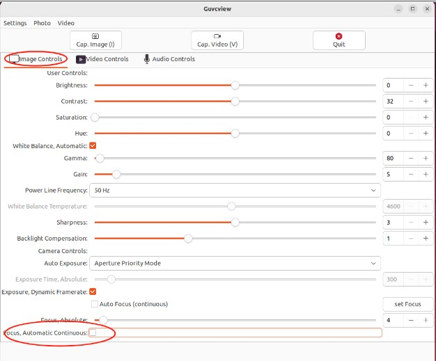
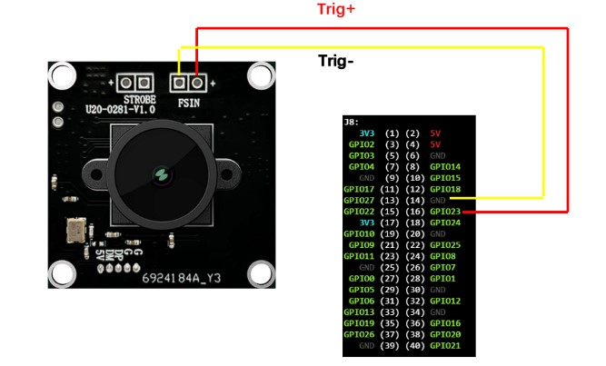
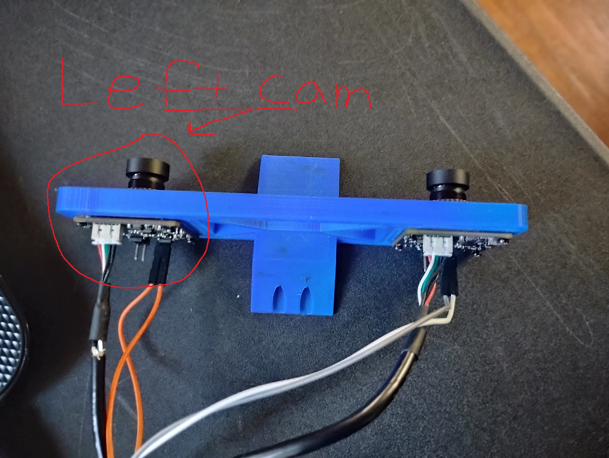
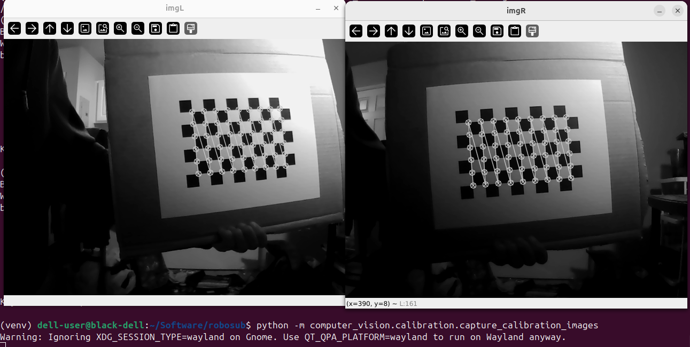
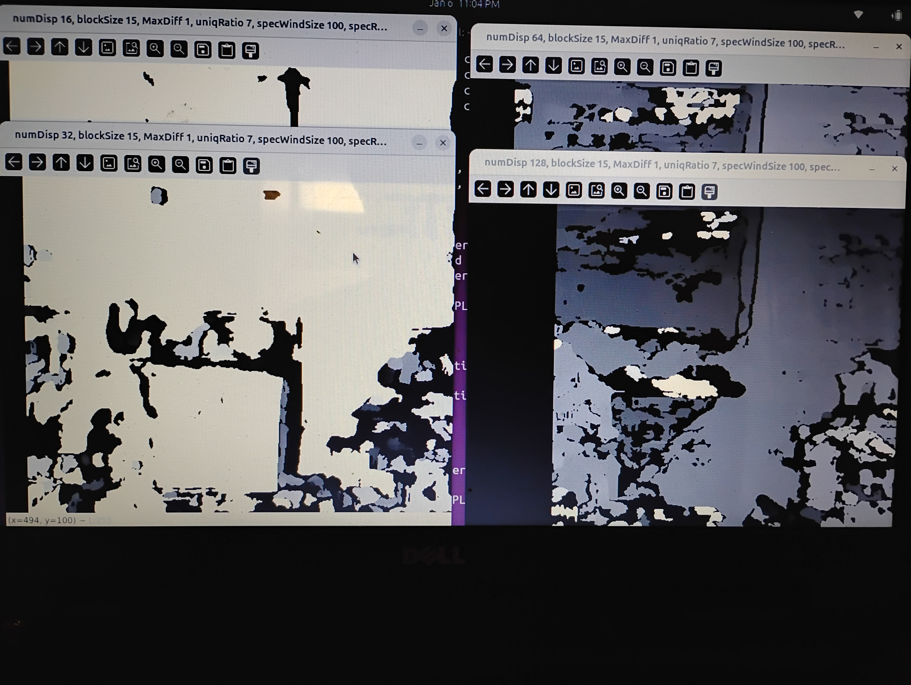

# robosub
The software for Competitive Robotics Underwater Autonomous Vehicle


# Computer Vision Documentation

## Camera Setup

### Installing Utilities
Reference the document U20CAM-9281M-V1.1 for details of full camera operation and setup. 
1. To operate camera with GUI on Linux, install Guvcview with ```sudo apt install guvcview```. 
2. For command line camera control, install V4L with ```sudo apt-get install v4l-utils```.

### Test Trigger Mode
1. To enable external trigger with Guvcview, run using ```sudo guvcview```. 
2. Next, enable (check mark) "Focus, Automatic Continous" setting. 

<div align="center">
     
</div>

If no microcontroller is currently triggering FSIN then camera view will freeze and may prompt a force shutdown, if so click on "Wait". This is expected since the camera is not getting prompted to get a new frame. For example trigger script see additional_documentation/camera_imter.ino.
3. Now attach microcontroller with triggering script running. The cameras should now be capturing frames when triggered. Note, the FPS of camera may or may not match triggering rate. Testing shows that guvcview did not show camera FPS greater than 16 FPS.

<div align="center">
     
</div>

### Finding camera Id's
Next find correct camera device id's. Make sure both cameras are connected and microcontroller is triggering FSIN.

1. Open Guvcview and go to Video Controls tab near the top.
2. Click on Device dropdown. Treat the list of devices with index values starting with the top as index 0.
3. Click through the devices to find the correct camera device(s). If a popup says open new window appears click "New". Correct video devices will likely be every 2 devices such as index 0 and 2 or 1 and 3.
4. Once correct cameras were found, in a terminal run ```v4l2-ctl --list-devices```. The /dev/videoX will correspond to the index you found earlier. For 2 cameras the /dev/videoX and /dev/videoY will be the corresponding X and Y index you found earlier. 
5. Open config.py and change LEFT_CAM_ID and RIGHT_CAM_ID to correct id value. Note left is the camera that is left when lens face opposite of your view and usb connector pins face you. 

<div align="center">
  
</div>

6. From robosub (project root) run ```python -m computer_vision.test.test_two_camera_stream```. Verify that the "Left" and "Right" windows are marked correctly. 

## Camera Calibration

### Capture Calibration Images

1. Obtain checkered board. Previously tested on 10 x 7. Go to computer_vision/calibration/capture_calibration_images.py and update CHECKER_BOARD_ROWS and CHECKER_BOARD_COLUMNS. Note only count inner rows and columns for example a 10x7 board will actually be rows = 6, comuns = 9. Also update CHECKER_BOARD_SQUARE_SIZE in meters.

<div align="center">
     
</div>

2. From project root run ```python -m computer_vision.calibration.capture_calibration_images```.
3. You will see a live feed of the camera. Hold the checkerboard up to the cameras. Make sure the board covers 30-70% of screen and all squares are visible. Press "c" on keyboard to capture image. 
4. If inner corners of checkerboard are found press "y" to save image for calibration, if it doesn't press "n" to discard. 

<div align="center">
     
</div>

5. Continue to capture test images until script ends. Capture images with boards in different positions and orientations. Images will be saved to calibration_images_left/ and calibration_images_right/


### Camera and Stereo Calibration

1. Run ```python -m computer_vision.calibration.opencv_fisheye_calibration```. This will produce stereo_calibration_fisheye.npz which contains calibration variables. 
3. Find a good scene to use for disparity map testing. The scene should have diverse textures and good lighting. To capture scene for testing and tuning run ```python -m computer_vision.calibration.capture_tuning_images```.
4. Press "c" to capture scene. You can capture multiple scenes to use for testing with this script. Press "q" to quit. Scenes are saved to calibration_tuning_images/in/left and calibration_tuning_images/in/right/. 
5. Run ```python -m computer_vision.calibration.parameter_tuning```. This will open the disparity map using script default values. The disparity map will be based on the captured images from step 4. By default the first image captued will be shown. To change the image used for tuning change the "test_image_index" varible in the script. Press any key to continue.
6. Next a display of the disparity map with various values will be displayed. Key track of the best "numDisp" value. Press any key to continue. 

<div align="center">
     
</div>

7. Next enter the best "numDisp" that you found from step 6 into the terminal running the script. Hit enter. Now disparity maps with different "blockSize" values will be shown. The disparity maps will use the "numDisp" given in the last step. This process will continue for all disparity map parameters. 
8. Repeat step 6 and 7 for the different parameters. Continue the script process.
9. Take note of the parameters and enter them into /computer_vision/main/stereo_vision.py. See below.
```python
# grab values found with parameter_tuning.py
channels = 1 # since using grayscale use 1
num_disp = 128
block_size = 10
stereo = cv2.StereoSGBM_create(
# left_matcher = cv2.StereoSGBM_create(
    minDisparity=0,
    numDisparities=num_disp,
    blockSize=block_size,
    P1=8 * channels * block_size**2, # recommended openCV formula
    P2=32 * channels * block_size**2, # recommended openCV formula
    disp12MaxDiff=1,
    uniquenessRatio=2,
    speckleWindowSize=100,
    speckleRange=2
)
```

## Stereo Vision Testing

1. Run ```python -m computer_vision.main.stereo_vision```. By default the resulting disparity map will be displayed. Change "display" variable to False to remove disparity map display and improve performance. 
2. Additional adjustments to "stereo = cv2.StereoSGBM_create" parameters may be needed based on live test.
3. By default script will blur and morphological close to avoid black blobs. To see raw disparity map comment out below. 
```python
# median blur to remove noise and black blobs
disparity[disparity <= 0] = 0
disparity = cv2.medianBlur(disparity.astype(np.float32), 5)

# morphological closing to remove black blobs
kernel = np.ones((3,3), np.uint8)
disparity = cv2.morphologyEx(disparity, cv2.MORPH_CLOSE, kernel)
```
4. If there is a lot of black blobs and the bluring and morphological closing isn't enough then using WLS (Weighted Least Square) filter may help remove most black blobs. To use WLS comment and uncomment as shown below. Note from prevous testing using WLS results in more error in distance measurements compared to raw disparity map or disparity map with blur and closing. However, WLS filter seems to be the best option for removing black blobs. Disparity map with blur and closing have shown the best overall performance which is why it is the default behavior. 
```python
# stereo = cv2.StereoSGBM_create(
left_matcher = cv2.StereoSGBM_create(
    minDisparity=0,
    numDisparities=num_disp,
    blockSize=block_size,
    P1=8 * channels * block_size**2, # recommended openCV formula
    P2=32 * channels * block_size**2, # recommended openCV formula
    disp12MaxDiff=1,
    uniquenessRatio=2,
    speckleWindowSize=100,
    speckleRange=2
)

# disparity without wls seems to have better distance results but has more black holes in disparity map
# disparity = stereo.compute(frame0, frame1).astype(np.float32) / 16.0 # comment out this line and uncomment below to try wls filter

# uncomment below and left_matcher above to use wls which highly reduces black blobs but seems to reduce distance accuarcy
# right_matcher = cv2.ximgproc.createRightMatcher(left_matcher)
# compute raw disparities
dispL = left_matcher.compute(frame0, frame1).astype(np.int16)
dispR = right_matcher.compute(frame1, frame0).astype(np.int16)
#  WLS Filter
wls = cv2.ximgproc.createDisparityWLSFilter(matcher_left=left_matcher)
wls.setLambda(4000)          # smoothness strength
wls.setSigmaColor(1.5)       # edge sensitivity

disparity = wls.filter(dispL, frame0, disparity_map_right=dispR)
```


## Usage

After all setup, calibration, and testing is finished, functions such as get_center_distance() or get_closest_obj_distance() can be used to help the robot avoid obstacles or determine its relative position to other objects. 